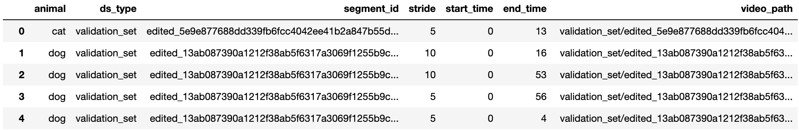

# Fine-tuning for Locomotion Prediction (LP) 

## Description
Planning where to move involves a complex interplay of both perception and foresight. It requires the ability to anticipate potential obstacles, consider various courses of action, and select the most efficient and effective strategy to achieve a desired goal. EgoPet contains examples where animals plan a future trajectory to achieve a certain goal (e.g., a dog following its owner).

Given a sequence of past $m$ video frames $\{x_i\}^{t}_{i=t-m}$, the goal is to predict the unit normalized future trajectory of the agent $\{v_j\}^{t+k}_{j=t+1}$, where $v_j\in \mathbb{R}^{3}$ represents the relative location of the agent at timestep $j$. We predict the unit normalized relative location due to the scale ambiguity of the extracted trajectories. In practice, we condition models on $m=16$ frames and predict $k=40$ future locations which correspond to $4$ seconds into the future.

Given an input sequence of frames, DPVO returns the location and orientation of the camera for each frame. For our EgoPet data we found that a stride (the rate at which we kept frames) of $5$ worked best but in some cases a stride of $10$ and $15$ worked better. While DPVO worked well, there were some inaccurate trajectories, so two human annotators were trained to evaluate a trajectory from an eagle's eye view of the trajectory (XZ view). Annotators were trained to choose which stride of DPVO produced the poses that best matched the trajectory if any at all. 

For more information about the LP task refer to our paper! 

## Dataset Information
`locomotion_prediction_train.csv` and `locomotion_prediction_train_25.csv` are csv files in which every row represents a single training sample and the 25 refers to 25% of the data which we use in the experiments in the paper. `locomotion_prediction_val.csv` is the csv file for the validation set. 


The DPVO generated trajectories can be downloaded from [here](https://drive.google.com/file/d/1kgwhAnjrSoOSPx9s4F013NgmNEi5K0KV/view?usp=sharing).

### Columns documentation:
```
animal - source animal of ego footage
ds_type - train/validation
segment_id - id for segment within video
stride - the DPVO stride for this trajectory
start_time - start time of this trajectory
end_time - end time of this trajectory
video_path - path to segment video
```

## Evaluation

As a sanity check, run evaluation using our MVD **fine-tuned** models:

<table><tbody>
<!-- START TABLE -->
<!-- TABLE HEADER -->
<th valign="bottom"></th>
<th valign="bottom">MVD (EgoPet)</th>
<!-- TABLE BODY -->
<tr><td align="left">fine-tuned checkpoint</td>
<td align="center"><a href="https://drive.google.com/file/d/1KyZylm9kEF4L4MB3TOWKAKJEu4c9AqIm/view?usp=sharing">download</a></td>
</tr>
<tr><td align="left">reference ATE</td>
<td align="center">0.474</td>
</tr>
</tr>
<tr><td align="left">reference RPE</td>
<td align="center">0.171</td>
</tr>
</tbody></table>

Evaluate VideoMAE/MVD on a 1 node with 8 GPUs. (`{EGOPET_DIR}` is a directory containing `{training_set, validation_set}` sets of EgoPet, `{TRAIN_CSV}` is the path to the train csv to use. `{RESUME_PATH}` is the path to the model you want to evaluate.):
```
EGOPET_DIR='your_path/egopet/training_and_validation_test_set'
TRAIN_CSV='locomotion_prediction_train_25.csv'
RESUME_PATH='path/to/model/egopet_lp_linearprobing_vitb_checkpoint-00014.pth'
OMP_NUM_THREADS=1 python3 -m torch.distributed.launch --master_port=29101 
--nproc_per_node=8 --use_env \
run_locomotion_prediction_finetuning.py \
--num_workers 7 \
--model vit_base_patch16_224 \
--input_size 224 \
--validation_batch_size 8 \
--path_to_data_dir ${EGOPET_DIR} \
--train_csv ${TRAIN_CSV} \
--path_to_trajectories_dir ${PATH_TO_TRAJECTORIES_DIR} \
--num_pred 3 \
--resume ${RESUME_PATH} \
--animals cat,dog --num_condition_frames 16 --num_pose_prediction 120 --pps 10 --fps 30 \ 
--scale_invariance dir \
--dist_eval --eval
```
Evaluating on MVD (EgoPet) should give:
```
* loss 0.36006
* ate 0.47448
* rpe_trans 0.17098
* rpe_rot 0.00000
Loss of the network on the 167 test images: 0.4%
Min loss: 0.360%
```

## Linear Probing

To fine-tune a pre-trained ViT-Base VideoMAE/MVD with **single-node training**, run the following on 1 node with 8 GPUs:
```
OUTPUT_DIR='./logs_dir/mvd_vit_base_with_vit_base_teacher_egopet/finetune_on_object_interaction'
EGOPET_DIR='your_path/egopet/training_and_validation_test_set'
CSV_PATH='csv/locomotion_prediction_train_25.csv'
FINETUNE_PATH='./logs_dir/mvd_vit_base_with_vit_base_teacher_egopet/checkpoint-2669.pth'
PATH_TO_TRAJECTORIES_DIR='your_path/interp_trajectories'
OMP_NUM_THREADS=1 python3 -m torch.distributed.launch --nproc_per_node=8 --use_env \
    run_locomotion_prediction_finetuning.py \
    --output_dir ${OUTPUT_DIR} \
    --num_workers 5 \
    --model vit_base_patch16_224 \
    --path_to_data_dir ${EGOPET_DIR} \
    --path_to_trajectories_dir ${PATH_TO_TRAJECTORIES_DIR} \
    --train_csv ${CSV_PATH} \
    --finetune ${FINETUNE_PATH} \
    --input_size 224 \
    --opt adamw --opt_betas 0.9 0.999 --weight_decay 0.05 \
    --batch_size 16 --validation_batch_size 8 --update_freq 8 --num_sample 2 \
    --save_ckpt_freq 1 --auto_resume \
    --num_pred 3 --num_condition_frames 16 --num_pose_prediction 120 \
    --animals cat,dog --pps 10 --fps 30 --scale_invariance dir \
    --dist_eval \
    --lr 5e-4 --epochs 15
```
To train ViT-Large or ViT-Huge, set `--model vit_large_patch16` or `--model vit_huge_patch14`.