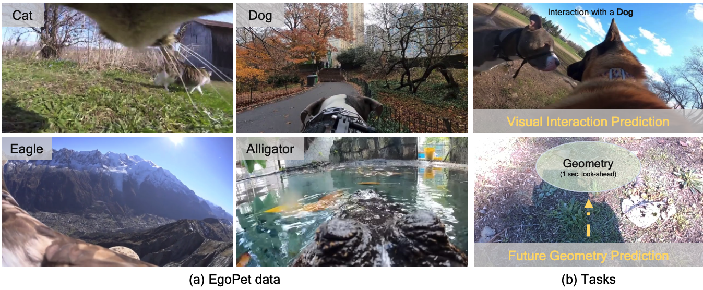

# EgoPet: Egomotion and Interaction Data from an Animal's Perspective
### [Amir Bar](https://amirbar.net), [Arya Bakhtiar](), [Antonio Loquercio](https://antonilo.github.io/), [Jathushan Rajasegaran](https://people.eecs.berkeley.edu/~jathushan/), [Danny Tran](), [Yann LeCun](https://yann.lecun.com/), [Amir Globerson](http://www.cs.tau.ac.il/~gamir/), [Trevor Darrell](https://people.eecs.berkeley.edu/~trevor/)
<p align="center">
  
</p>

This repository is the implementation of the pretraining and linear probing experiments in this paper.

## Abstract
Animals perceive the world to plan their actions and interact with other agents to accomplish complex tasks, demonstrating capabilities that are still unmatched by AI systems. To advance our understanding and reduce the gap between the capabilities of animals and AI systems, we introduce a dataset of pet egomotion imagery with diverse examples of simultaneous egomotion and multi-agent interaction. Current video datasets separately contain egomotion and interaction examples, but rarely both at the same time. In addition, EgoPet offers a radically distinct perspective from existing egocentric datasets of humans or vehicles.  We define two in-domain benchmark tasks that capture animal behavior, and a third benchmark to assess the utility of EgoPet as a pretraining resource to robotic quadruped locomotion, showing that models trained from EgoPet outperform those trained from prior datasets. This work provides evidence that today's pets could be a valuable resource for training future AI systems and robotic assistants.

## EgoPet Dataset
Please follow the instructions at this github repo [here](https://github.com/bakhtiararya/EgoPet_dataset_download) for data preparation.

## Pre-training
### Installation
Please follow the instructions in [INSTALL.md](INSTALL.md).

### Pretrain an MVD model on EgoPet dataset:
* Download VideoMAE ViT-B checkpoint from [here](https://drive.google.com/file/d/1tEhLyskjb755TJ65ptsrafUG2llSwQE1/view)
* Download MAE ViT-B checkpoint from [here](https://dl.fbaipublicfiles.com/mae/pretrain/mae_pretrain_vit_base.pth)

Run the following command:
```
OUTPUT_DIR='./logs_dir/mvd_vit_base_with_vit_base_teacher_egopet'
IMAGE_TEACHER="path/to/mae/checkpoint"
VIDEO_TEACHER="path/to/kinetics/checkpoint"
DATA_PATH='egopet_pretrain.csv'
GPUS=8
NODE_COUNT=4
RANK=0
MASTER_PORT=29500
OMP_NUM_THREADS=1 python3 -m torch.distributed.launch --nproc_per_node=${GPUS} --use_env \
        --master_port ${MASTER_PORT} --nnodes=${NODE_COUNT} \
        --node_rank=${RANK} --master_addr=${MASTER_ADDR} \
        run_mvd_pretraining.py \
        --data_path ${DATA_PATH} \
        --data_root ${DATA_ROOT} \
        --model pretrain_masked_video_student_base_patch16_224 \
        --opt adamw --opt_betas 0.9 0.95 \
        --log_dir ${OUTPUT_DIR} \
        --output_dir ${OUTPUT_DIR} \
        --image_teacher_model mae_teacher_vit_base_patch16 \
        --distillation_target_dim 768 \
        --distill_loss_func SmoothL1 \
        --image_teacher_model_ckpt_path ${IMAGE_TEACHER} \
        --video_teacher_model pretrain_videomae_teacher_base_patch16_224 \
        --video_distillation_target_dim 768 \
        --video_distill_loss_func SmoothL1 \
        --video_teacher_model_ckpt_path ${VIDEO_TEACHER} \
        --mask_type tube --mask_ratio 0.9 --decoder_depth 2 \
        --batch_size 16 --update_freq 2 --save_ckpt_freq 10 \
        --num_frames 16 --sampling_rate 4 \
        --lr 1.5e-4 --min_lr 1e-4 --drop_path 0.1 --warmup_epochs 268 --epochs 2680 \
        --auto_resume
```

### Pretrained Models
| Model             | Pretraining | Epochs | Link |
|-------------------|-------------|--------|------|
| MVD (ViT-B) | EgoPet    | 2670   |   [link](https://drive.google.com/file/d/1_Ky73DpjvSh5k4g-xhWE6QTndRlfUTHp/view?usp=sharing)   |

## Visual Interaction Prediction (VIP)

The fine-tuning instructions for the VIP task is in [VIP.md](VIP.md).

## Locomotion Prediction (LP)

The fine-tuning instructions for the LP task is in [PL.md](PL.md).

## Vision to Proprioception Prediction (VPP)

The fine-tuning instructions for the VPP task is in [VPP.md](VPP.md).

## Acknowledgements

This project is built upon [MVD](https://github.com/ruiwang2021/mvd/tree/main), [MAE_ST](https://github.com/facebookresearch/mae_st), and [DPVO](https://github.com/princeton-vl/DPVO). Thank you to the contributors of these codebases!