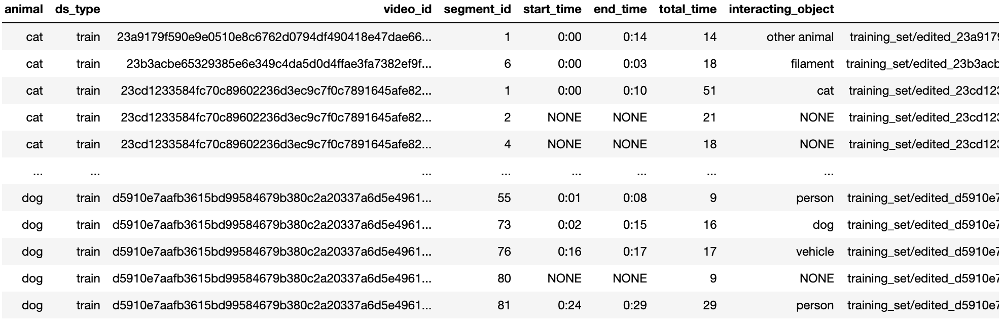

# Fine-tuning for Visual Interaction Prediction (VIP) Classification

## Description
Studying animal interactions from an egocentric perspective provides insights into how they navigate, manipulate their surroundings, and communicate which is applicable in designing effective systems for real-world settings.

The input for this task is a video clip from the egocentric perspective of an animal. The output is twofold: a binary classification indicating whether an interaction is taking place or not, and identification of the subject of the interaction. In the EgoPet dataset, an “interaction” is defined as a discernible event where the agent demonstrates clear attention (physical contact, proximity, orientation, or vocalization) to an object or another agent with visual evidence. Aimless movements are not labeled as interactions.

The beginning of an interaction is marked at the first time-step where the agent begins to give attention to a target, and the endpoint is marked at the last time-step before the attention ceases. There are 644 positive interaction segments with 17 distinct interaction subjects and 556 segments where no interaction occurs (“negative segments”). The segments were then split into train and test. For both training and testing, we sampled additional negative segments from the videos, ensuring these did not overlap with the positive segments. We sampled 125 additional negative training segments and 124 additional negative test segments, leaving us with 754 training segments and 695 test segments, for a total of 1,449 annotated segments.

For more information about the VIP task refer to our paper! 

## Dataset Information
`object_interaciton_train.csv` and `object_interaciton_validation.csv` are csv files in which every row represents a single training or validation sample.


### Columns documentation:
```
animal - source animal of ego footage
ds_type - train/validation
video_id - hashing of video
segment_id - id for segment within video
start_time - start time of interaction, if NONE there is no interaction in the entire clip
end_time - end time of interaction, if NONE there is no interaction in the entire clip
total_time - total time of segment video
interacting_object - object being interacted with
video_path - path to segment video
```

### Interacting Object Categories
Chosen from common interaction objects.
```
person
ball
bench
bird
dog
cat
other animal
toy
door
floor
food
plant
filament
plastic
water
vehicle
other
```

## Evaluation

As a sanity check, run evaluation using our MVD **fine-tuned** models:

<table><tbody>
<!-- START TABLE -->
<!-- TABLE HEADER -->
<th valign="bottom"></th>
<th valign="bottom">MVD (EgoPet)</th>
<!-- TABLE BODY -->
<tr><td align="left">fine-tuned checkpoint</td>
<td align="center"><a href="https://drive.google.com/file/d/1m9ssA4IGRRtwpymxob_8EEKDHGYZUZoh/view?usp=sharing">download</a></td>
</tr>
<tr><td align="left">reference Interaction accuracy</td>
<td align="center">68.75</td>
</tr>
</tr>
<tr><td align="left">reference Interaction AUROC</td>
<td align="center">74.50</td>
</tr>
</tr>
<tr><td align="left">reference Subject Prediction Top-1 accuracy</td>
<td align="center">35.38</td>
</tr>
</tr>
<tr><td align="left">reference Subject Prediction Top-3 accuracy</td>
<td align="center">66.43</td>
</tr>
</tbody></table>

Evaluate VideoMAE/MVD on a single GPU (`{EGOPET_DIR}` is a directory containing `{training_set, validation_set}` sets of EgoPet, `{CSV_PATH}` is a directory containing `{object_interaction_train.csv, object_interaction_validation.csv}` which is `csv/`):
```
EGOPET_DIR='your_path/egopet/training_and_validation_test_set'
CSV_PATH='csv/'
FINETUNE_PATH='path/to/model'
python run_object_interaction_finetuning.py --num_workers 5 --model vit_base_patch16_224 --latent_dim 18 --data_path ${EGOPET_DIR} --csv_path ${CSV_PATH} --finetune ${FINETUNE_PATH} --input_size 224 --batch_size 64 --num_frames 8 --num_sec 2 --fps 4 --alpha 1 --eval
```
Evaluating on MVD (EgoPet) should give:
```
* loss 1.736
* Acc@1_interaction 68.750 auroc_interaction 0.745
* Acc@1_object 35.379 Acc@3_object 66.426 auroc_object 0.690
Loss of the network on the 695 test images: 1.7%
Min loss: 1.000%
```

## Linear Probing

To fine-tune a pre-trained ViT-Base VideoMAE/MVD with **single-node training**, run the following on 1 node with 8 GPUs:
```
OUTPUT_DIR='./logs_dir/mvd_vit_base_with_vit_base_teacher_egopet/finetune_on_object_interaction'
EGOPET_DIR='your_path/egopet/training_and_validation_test_set'
CSV_PATH='csv/'
FINETUNE_PATH='./logs_dir/mvd_vit_base_with_vit_base_teacher_egopet/checkpoint-2669.pth'
OMP_NUM_THREADS=1 python3 -m torch.distributed.launch --nproc_per_node=8 --use_env \
    run_object_interaction_finetuning.py \
    --output_dir ${OUTPUT_DIR} \
    --num_workers 5 \
    --model vit_base_patch16_224 \
    --latent_dim 18 \
    --data_path ${EGOPET_DIR} \
    --csv_path ${CSV_PATH} \
    --finetune ${FINETUNE_PATH} \
    --input_size 224 \
    --opt adamw --opt_betas 0.9 0.999 --weight_decay 0.05 \
    --batch_size 64 --update_freq 2 --num_sample 2 \
    --save_ckpt_freq 10 --auto_resume \
    --num_frames 8 --num_sec 2 --fps 4 --object_interaction_ratio 0.5 \
    --alpha 1 \
    --lr 5e-4 --epochs 15
```
To train ViT-Large or ViT-Huge, set `--model vit_large_patch16` or `--model vit_huge_patch14`.